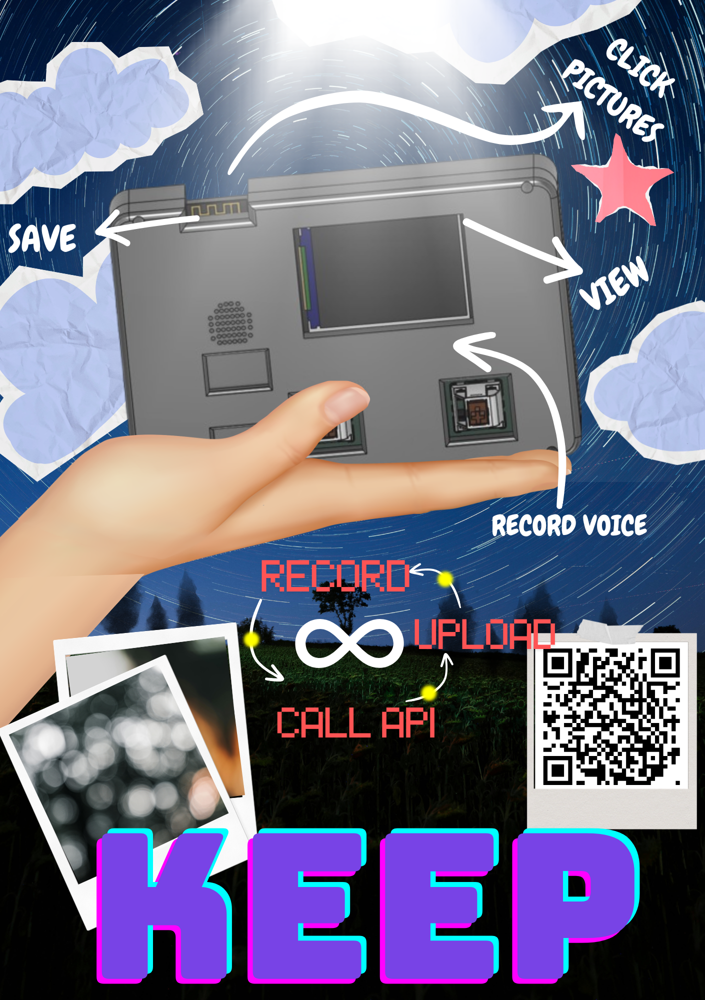
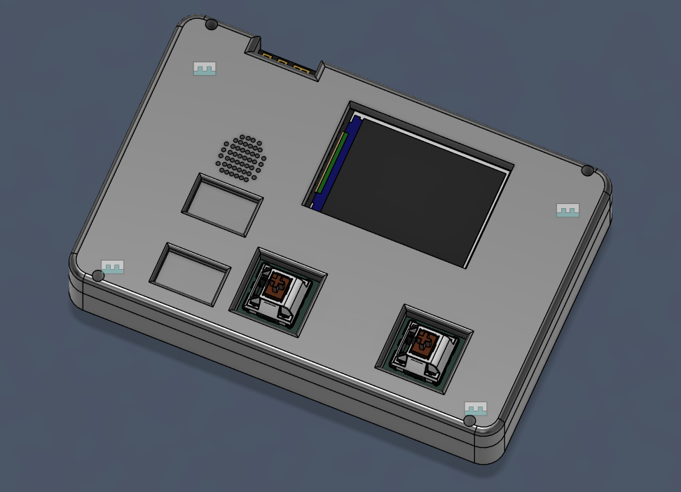
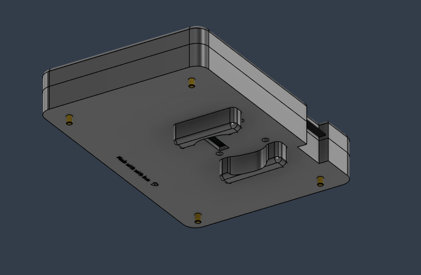
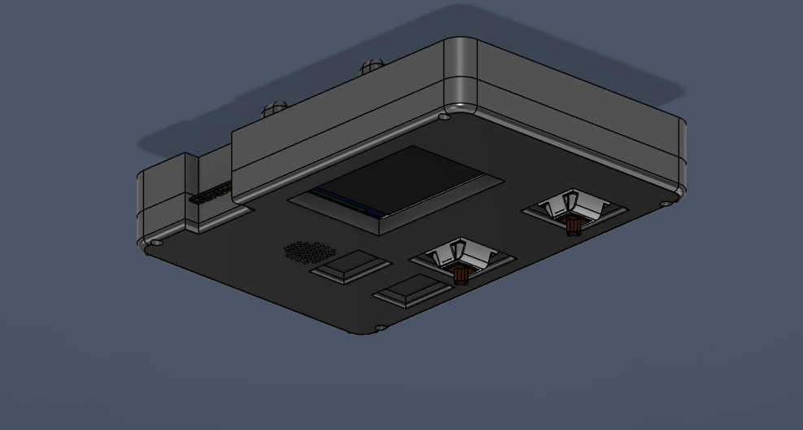
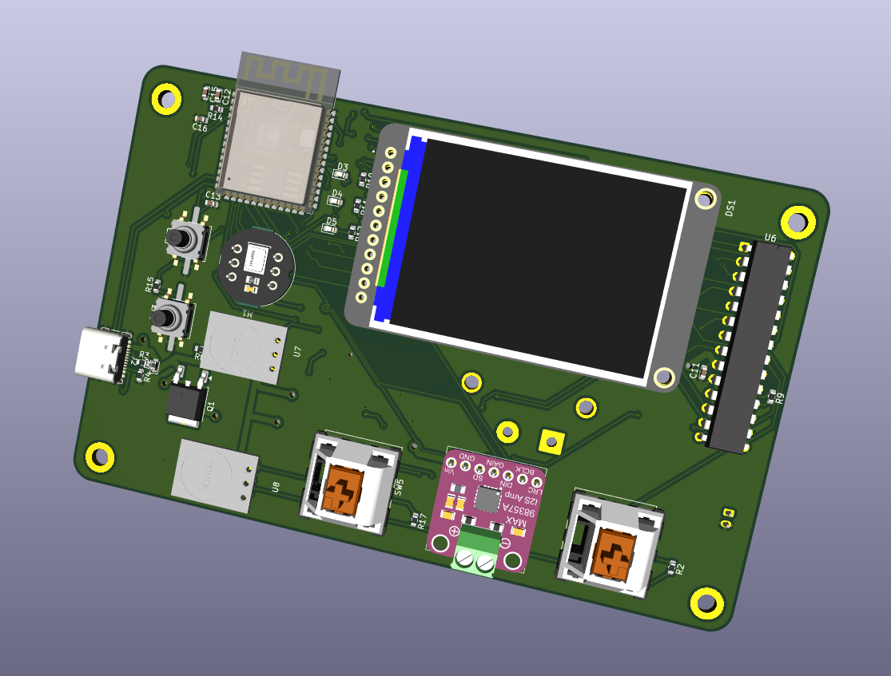
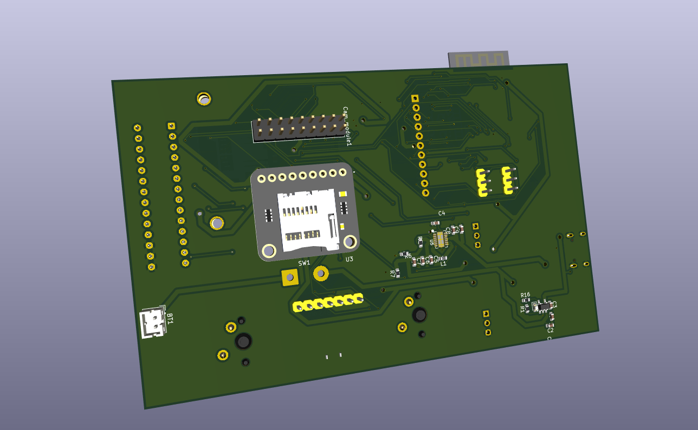

# Life in Pocket

This is a self-claimed cutesy 😛, portable, all-in-one journalling device for you to keep track of your life moments and memories through images taken through the inbuilt camera and voice recording taken through the inbuilt microphone. You can save memories with a title, detailed description and multiple pictures to enrich your journal timeline thorugh the means of an api to the website [Keep](https://keeplife.vercel.app/).

Create an account at [Keep](https://keeplife.vercel.app/) and begin Keep-ing :)

---

## Why build life_in_pocket?
I have always feared that life will just slip by while I am on autopilot. To tackle that fear I have always been keen on journalling and capturing moments to reminisce later. Building Keep and life_in_pocket has allowed me to do exactly that, capture life!

---

## Custom build 3d Case

## Single board 2 layer PCB

## Features

**Capture Moments** — With the ondevice camera take pcitures and videos and save to sd card or/and upload to your keep account.

**Record Voice** — Record and reflect on your day, feelings and mood from the ondevice inp441 mic module to save to SD card or your Keep account.

**GUI on the TFT** — 2inch bright color tft screen where you can fetch your timeline straight from your keep account to view it ondevice without any phone or computer.

 See [Keep](https://github.com/PuurfectDev-MD/keep) for more details on the API and account.

---

### How it works and how to make your own

There is a custom built PCB designed in KiCad where you solder the necessary components, then upload the firmware. To get it working you need to set your WiFi credentials and paste your Keep API key into the firmware.

Change the WiFi credentials in [setup.py](firmware/setup.py)and paste your API key from your Keep account in [actions.py](firmware/actions.py). Then 3D print the case using the files provided in the 3d models folder.

**Firmware** — setup.py initialises all the communication protocols, components and WiFi connection. From there, main.py listens for control changes and switches the active page accordingly, which then handles input differently depending on what page you are on.

**Hardware** — the components come together to create a polished physical experience. The TFT display handles the UI, the camera captures images, the mic module handles sound input and a speaker handles sound output. There are 4 inputs total, 2 capacitive TTP223 touch sensors and 2 MX switches. You capture memories through the camera and record voice memos through the mic, then hit upload and actions.py takes care of sending everything to your Keep account through the API.

The firmware is not 100% complete yet. Once I get all the components in hand, I will be testing the existing code, fixing issues and adding features along the way.

## Contributing

Feel free to reach out with suggestions or improvements on the pcb, 3d case or the website. I would be happy to work with anyone who wants to contribute to the project!

---

*Made with love ❤️*